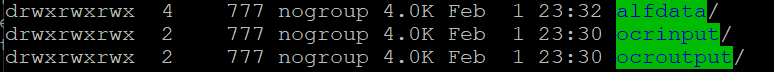
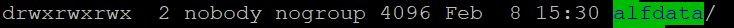
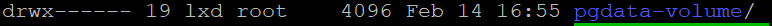

# installing NFS server and client and setup
https://phoenixnap.com/kb/ubuntu-nfs-server

# mount error
when mount a container to a created-volume:
```shell
docker run -d  --name postgres-container  -v nfs-volume:/var/lib/postgresql/data  postgres:14.4
```

error shows:
```sh
docker: Error response from daemon: failed to copy file info for /var/lib/docker/volumes/nfs-volume/_data: failed to chown /var/lib/docker/volumes/nfs-volume/_data: lchown /var/lib/docker/volumes/nfs-volume/_data: operation not permitted.
See 'docker run --help'.

```

as this answer suggested:

https://stackoverflow.com/questions/56126490/docker-run-on-nfs-mount-causes-fail-to-copy-and-fail-to-chown

I changed my docker run cmd:
```shell
docker run -d  --name postgres-container  -v nfs-volume:/var/lib/postgresql/data:nocopy  postgres:14.4
```
This works.

# NFS volume configuration options
## volume options in docker compose file -1
```yaml
services:
    postgres:
        image: postgres:14.4
        ... ...
        volumes:
            - type: volume
              source: alfresco_postgres_test-volume 
              target: /var/lib/postgresql/data
              volume:
                nocopy: true  

volumes:
    alfresco_postgres_test-volume:
        driver_opts:
        type: "nfs"
        o: "addr=192.168.221.133,nolock,soft,rw" # 129.69.209.200
        device: ":/mnt/nfsdir"
```
### nocopy
a flag to disable copying of data from a container when a volume is created.

according to this answer: https://stackoverflow.com/questions/38287388/docker-and-volumes-nocopy#:~:text=The%20nocopy%20modifier%20is%20for%20when%20you%20are,you%20are%20creating%20isn%27t%20on%20the%20shared%20volume.
The nocopy modifier is for when you are creating a volume and data already exists in the container's path, you can specify if you want that data copied when the volume is created.

### soft
If the NFS Server is unavailable, it would stop tring and report an error.
It it's set to ```hard```, the client will keep tring until the server came back

### rw
read write permission

## server export file options
```yaml
    - name: Add new Line
      ansible.builtin.lineinfile:
        state: present
        dest: /etc/exports
        line: "{{ SERVER_MNT_PATH }} {{ item }}(rw,sync,no_subtree_check,no_root_squash)"
        # https://github.com/docker-library/postgres/issues/361
        insertafter: EOF
      loop:
        "{{ CLIENTS_IPS }}"
```

https://www.thegeekdiary.com/understanding-the-etc-exports-file/

### rw
give read write permission accessing NFS.

### sync
File data changes are made to disk immediately, which has an impact on performance, but is less likely to result in data loss. On some distributions this is the default.
### no_subtree_check
https://www.linuxquestions.org/questions/linux-newbie-8/please-explain-me-subtree_check-814080/#google_vignette

When an NFS server exports a subdirectory of a local file system, but leaves the rest unexported, the NFS server must check whether each NFS request is against a file residing in the area that is exported. This check is called the subtree check.

To perform this check, the server includes information about the parent directory of each file in NFS file handles that are handed out to NFS clients. If the file is renamed to a different directory, for example, this changes the file handle, even though the file itself is still the same file. This breaks NFS protocol-compliance, often causing misbehavior on clients such as ESTALE errors, inappropriate access to renamed or deleted files, broken hard links, and so on.

In the opinion of many, subtree checking causes much more trouble than it saves, and should be avoided in most cases. The subtree_check option is necessary only when you want to prevent a file handle guessing attack from gaining access to files that fall outside the exported part of your server's local file systems. If you need to be certain that noone can access files outside the exported part of a local file system, set up the partitions on your server so that you only export whole file systems. 
### no_root_squash
Map the root user and group account from the NFS client to the local root and group accounts.
Allows the root user on the client to have the same privileges on the server as the root users in server.

# The procedure of how I mount containers on NFS
1. create a local mount directory `mkdir -p {{MNT_DIR}}`
2. mount this local dir on remote NFS server
`mount -o rw,soft,nolock, {{NFS_SERVER_IP}}:{{NFS_MNT_DIR}} {{LOCAL_MNT_DIR}}`
e.g. `mount -o rw,soft,nolock, 192.168.221.133:/home/ubuntu/mntnfs /mount/nfs`
check the details with `mount -t nfs4`
3. create sub directory for each volume `mkdir -p {{SUB_DIR}}` (e.g. `mkdir -p pgdata`)
4. give full permissions to everyone (Recursively)
```sh
sudo chmod u+rwx -R {{MNT_DIR}}
sudo chmod o+rwx -R {{MNT_DIR}}
sudo chmod g+rwx -R {{MNT_DIR}}
sudo chown 777:nogroup -R {{MNT_DIR}} # this one might not be necessary
#has to be CAPITAL R
```
check it with `ll` or `ls -l`, make sure they all looks like this:

or just like this:


4. define volume in docker compose part
```yaml
volumes:          
  - {{LOCAL_MNT_DIR}}:{{CONTAINER_DATA_DIR}}
```
e.g.
```yaml
volumes:          
  - /mount/nfs/alfdata:/usr/local/tomcat/alf_data
```
### issue with postgres


with postgres, have to 
1. mkdir and give full permission 
2. deploy it  
3. repository gives jdbc connection error, and the dir's permission & owner got changed to this:

(lxd:linux docker daemon)
4. change the permission again, `chown lxd:nogroup pgdata-volume`, into this:

5. deploy the container again, then success.
# useful commands
## to check one container's volume info
``` docker inspect --format '{{json .Mounts}}' {{CONTAINER_ID}}```

# troubleshooting
## 1 what I wanted to do
I wanted to mount several alfresco containers in a remote NFS server, including the following:

Repository container: /usr/local/tomcat/alf_data (for storing documents data and so on)
Postgres container: /var/lib/postgresql/data
Solr container: /opt/alfresco-search-services/data (for storing indexing data and so on)

(I defined the volumes path inside the container according to this:
https://github.com/Alfresco/alfresco-docker-installer/blob/master/generators/app/templates/7.0/docker-compose.yml )

## 2 why it did not work
It showed me several different errors, such as 
1) `The 'dir.root' property is set to a relative path './alf_data'.  'dir.root' should be overridden to point to a specific folder.`
2) `Failed to create store root: ./alf_data/contentstore.deleted`
3) `Unable to create file /usr/local/tomcat/logs/alfresco.log java.io.IOException: Permission denied`
4) `Failed to open access log file [/usr/local/tomcat/logs/local`
...

## 3 the issues I found
These errors are all related with permission issues.
Because the container will visit the remote directory with non-root role, so it's better set the the directory owned by nobody:nogroup. And also give full rwx permission to owner, group, and others.
## 4 how I fixed the issues
I modified the permission config using these commands:
```sh
sudo chmod u+rwx -R {{MNT_DIR}}
sudo chmod o+rwx -R {{MNT_DIR}}
sudo chmod g+rwx -R {{MNT_DIR}}
sudo chown 777:nogroup -R {{MNT_DIR}} # this one might not be necessary
```
For more details, check step 4 in section "The procedure of how I mount containers on NFS".