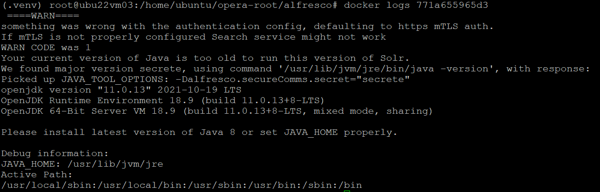
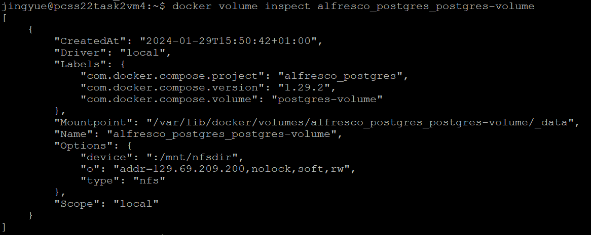

# troubleshooting Solr
## 1 what I wanted to do
I wanted to successfully start a Solr container without error.
## 2 why it did not work
It provides two way of communication between the repository and the solr: http and secret.
1) when I set it as "http", it gives me the error of: `Failed to initialize keystore`. and `java.io.FileNotFoundException: Caused by Can't find resource 'ssl.repo.client.keystore' in classpath or '/opt/alfresco-search-services/solrhome/alfresco'`
2) when I set it as "secret",it gives me the error of: java version error

## 3 the issues I found
For 1) http, I didn't find useful resource to fix the keystore error. I give up trying this way, also considerring all the docker-compose file provided use "secret" by default.
For 2) secrete, the Java JRE is supposed to be already packaged in the docker image. I cannot modify the version any more. I was assuming there might be some flaw with the image I'm using.
## 4 how I fixed the issues
Then I tried to change the image version.
From `docker.io/alfresco/alfresco-search-services:2.0.5` to `docker.io/alfresco/alfresco-search-services:2.0.6`.
Then this error goes away.
## to log into Admin console
if directly access http://{IP}:8083, it will return `Authentication failure: "secret" method has been selected, use the right request header with the secret word`.
according to: https://hub.alfresco.com/t5/alfresco-content-services-blog/shared-secret-communication-mode-for-repository-and-solr/ba-p/309862 
Use web browser plugin/extension to add the following header key: `X-Alfresco-Search-Secret: secret".
Then it's able to log into the concole.
# troubleshooting Repository
## 1 what I wanted to do
1) At first I was running the repository with the image of `docker.io/alfresco/alfresco-content-repository-community`. I need to change it to the governance version, which is `docker.io/alfresco/alfresco-governance-repository-community`, to get all the governance functions.
2) Also, with the content-version of repository, I could only search with document's title, not with the document's content. And solr gives no error in this situation. Plus, I was running a oringinal docker compose as a refernce system, with governance-version, and it was completely fine.
Therefore, I decide to change it to the governance image.
## 2 why it did not work
After changing the repository image version, solr gave error:
`java.net.UnknownHostException: alfresco`
## 3 the issues I found
Looks like solr cannot find the alias of "alfresco". But they were able to ping each other, thus probably not network issue.
Then I think of the memory size, I did `df -h`, and it already used up nearly 100% of space. Because both two versions of repostiory image have large sizes.
## 4 how I fixed the issues
I pruned images I don't need any more and clear out some space.
Then no errors. And it's able to search with both titles and contents.

# troubleshooting Postgres
Permmison issue of postgres's volume can leads to JDBC connection refused error.
## some useful command for quick reference

### log into psql (alfresco)
```psql -U alfresco```
### check all existing tables
```select * from pg_tables;```
### check one table's information
```\d {{table_name}}```

# postgres nfs volume info


# troubleshooting Postgres
Permmison issue of postgres's volume can leads to JDBC connection refused error.