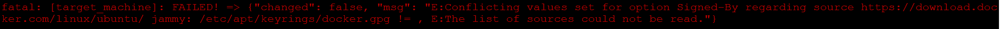

## 1
Gathering facts is also one task. (implicitly)
If not needed, better to set it as false : ```gather_facts: false```.

## 2 ways I've tried to run docker compose
```yaml
    # method 1： using shell, failed , stuck in the process
    - name: Run container
      become: True
      shell:
        cmd: "docker compose -f docker-compose.yaml up"
        chdir: /home/ubuntu/opera-root/activemq/docker-compose/

    # method 2： using docker_compose module to directly execute the file, throw unexpected error
    - name: deploy Docker Compose stack
      community.docker.docker_compose:
        project_src: /home/ubuntu/opera-root/activemq/docker-compose/
        files:
        - docker-compose.yaml
```
The third one is what I used in tosca implementations.

# 3 install docker engine and docker compose with ansible
## reference tutorial
1. radon implementation file
2. https://www.digitalocean.com/community/tutorials/how-to-use-ansible-to-install-and-set-up-docker-on-ubuntu-20-04

## erros I ran into
during this task：
```yaml
    - name: Add Docker repository
      apt_repository:
        filename: docker
        repo: deb [arch=amd64] https://download.docker.com/linux/{{ ansible_distribution|lower }} {{ ansible_distribution_release|lower }} stable
        update_cache: true
      when: ansible_os_family == "Debian"
```
If conflicts errors happens:
```Conflicting values set for option Signed-By regarding source https://download.docker.com/linux/ubuntu/```


solution:

according to https://unix.stackexchange.com/questions/732030/conflicting-values-set-for-option-signed-by-regarding-source

delete the following files:

```shell
sudo rm /etc/apt/keyrings/docker.gpg
sudo rm /etc/apt/sources.list.d/docker.list
```
## to uninstall docker (for testing)
```shell
sudo apt-get purge docker-ce docker-ce-cli containerd.io docker-buildx-plugin docker-compose-plugin docker-ce-rootless-extras
# to manually delete all images, containers, and volumes:
sudo rm -rf /var/lib/docker
sudo rm -rf /var/lib/containerd
```
reference:
https://docs.docker.com/compose/install/uninstall/
https://docs.docker.com/engine/install/ubuntu/#uninstall-docker-engine

## pip update
 python3 -m pip install --upgrade pip\

## pip install error
Sometimes Ansible will keep showing error of missing library
e.g. "jsondiff is not installed, try 'pip install jsondiff'"

Even if I hve already installed it, it's still seems missing for Ansible.
Then maybe you are instally under the wrong user's directory, switch user and install it again.

## ansible localhost ssh error
In playbook, I need to set `hosts` as `all`, and xopera will create an host var for the specific workstation this node is on, the host alias is called "opera".
If the workstation is called localhost, then it might show the following error:

`"msg": "Failed to connect to the host via ssh: Warning: Permanently added '192.168.221.163' (ED25519) to the list of known hosts.\r\nroot@192.168.221.163: Permission denied (publickey,password)."`

Because I haven't set SSH public key for localhost. Usually people dont ssh localhost.
Just cp the ssh public key.

`cat ~/.ssh/id_rsa.pub >> ~/.ssh/authorized_keys`

(The normal way to run in localhost in Ansible is like this, then it won't try to ssh localhost,
```yaml
hosts: localhost 
connection: local
```
But this is not possible if I'm using Xopera to operate Ansible.)


# debug host
    # - name: Print SSH address
    #   fail:
    #     msg: "conection is {{ansible_connection}}, SSH address is {{ ansible_host | default('Not defined') }},SSH user is {{ ansible_user | default('Not defined') }}"