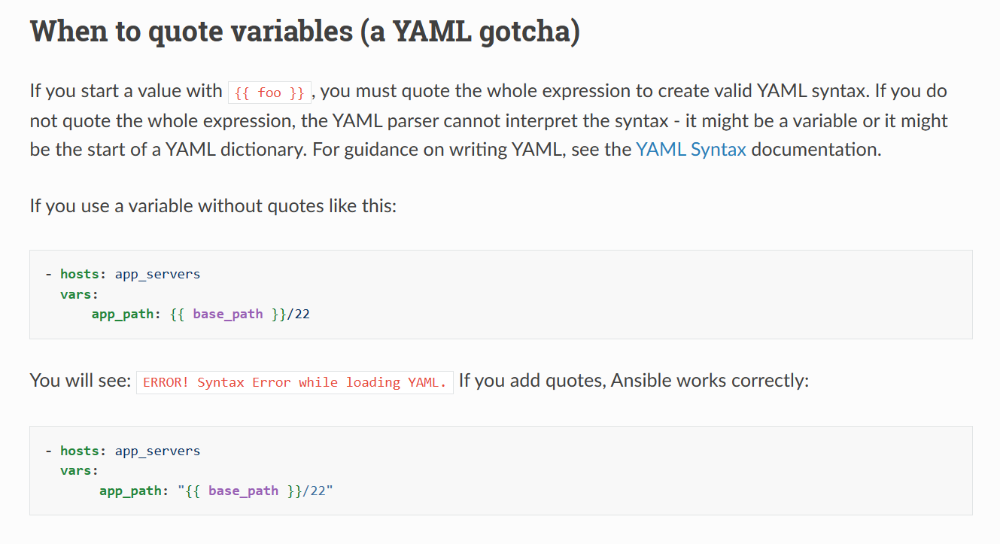
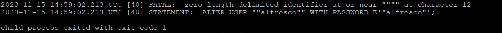
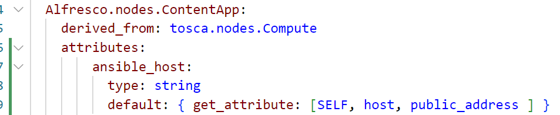
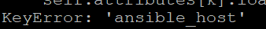
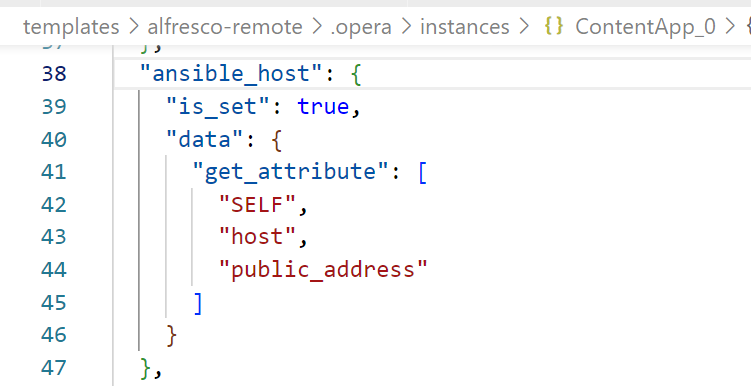
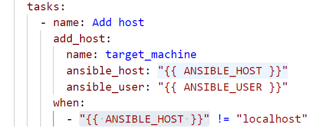
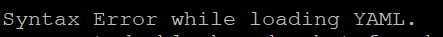
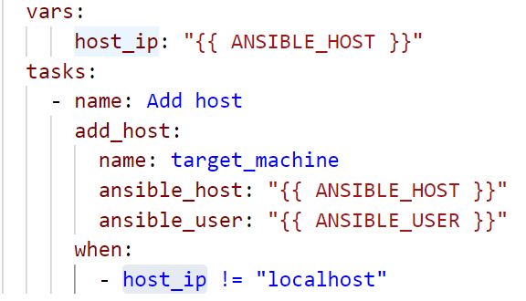
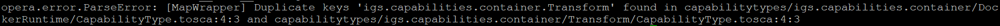

Here I make records for some bugs that I ran into, in case they show up again:

# postgres user creation parameters encoding 
### Problem description: 
Postgres's user "alfresco" couldn't be created correctly.

The comman way of passing input parameters to YAML is using the format of:
```
"{{ PARAMETER }}"
```
(according to Ansible's documentation:

https://docs.ansible.com/ansible/latest/playbook_guide/playbooks_variables.html
)

My original definition for postgres's creation Ansible task is:
```yaml
    - name: docker compose
      community.docker.docker_compose:
        ...
          services:
            postgres:
              environment:
                - POSTGRES_PASSWORD="{{ POSTGRES_PASSWORD }}"
                - POSTGRES_USER="{{ POSTGRES_USER }}"
                - POSTGRES_DB="{{ POSTGRES_DB }}"
              ...
```
However, the log of the container shows that parameters are wrapped with extra quotes, thus it's an encoding error:


### Solution:
Therefore I changed it to the format of ```{{ PARAMETER }}```
```yaml
    - name: docker compose
      community.docker.docker_compose:
        ...
          services:
            postgres:
              environment:
                - POSTGRES_PASSWORD={{ POSTGRES_PASSWORD }}
                - POSTGRES_USER={{ POSTGRES_USER }}
                - POSTGRES_DB={{ POSTGRES_DB }}
              ...
```
By this, the role of "alfresco" can be created. (Though it violates the rule of YAML syntax)

# Compiling error when using Xopera

### Problem description:
Sometimes I make changes to the code, without undeploying first. Then I run ```opera deploy service.yaml -c/-r```, Xopera will look for the previous defined types/attributes/properties in the old compiling file, which doesn't exist any more. And so leads to error.

For example:

If I defined a nodetype contains an attribute named as "ansible_host":


Later, I want to change this name to a more proper one "workstation_host". After I edited all relevant code and execute it directly, it would throw a keyerror/attributeerror, even thought there is no "ansible_host" existing in the code any more.:


(Using the clear flag doesn't help here: ```opera deploy service.yaml -c```, which means to deploy from the start.)

But you can still find "ansible_host" in the opera execution file.

Therefore Xopera is still looking for the old parameter "ansible_host" and throws the keyerror.

After the code has already been changed, if I try using undeploy, it would still throw the error.
### Solution:


solution 1: Go to .opera/instances/{{ your_node_type}},
use sudo privilige to manually change this parameter's name to match with your current code, then deploy again.

solution 2: Revert the code to what it looks like when you first deployed it. Then undeploy. Then make your desired changes.

solution 3: ```sudo rm -rf .opera```, getting rid of the old .opera file. Deploy again.
The best practise here, is always ```undeploy``` the service template, before making new changes to the code.

# Ansible "when"-condition syntax error
### Problem description
Ansible doesn't take double quote input paramter in "when" phrase, it will throw syntax error.


### Solution
Better put the input parameter into "var", then use it in the "when".


# Swarm overlay network
swarm needs one manager and one worker. 
The overlay network can only be created on the manager node.

When no containers is joined into the overlaynetwork in the manager node, the worker cannot see this network.

Thus, in the service template, the first container node should be deployed on the manager, joining the overlay network. Then other containers in the worker can join the same network.

Otherwise error: "Error starting project Network remote_network declared as external, but could not be found. Please create the network manually using `docker network create remote_network` and try again." 

And the driver type:overlay should be specified in the docker-compose part.
```yaml
  networks:
    remote_network:
      external: true
      driver: overlay
```
# map error of Xopera
If there is map error, it indicates missing tag or wrong tab.

# dup error in Xopera
In igs_types:

It's actually because I defined "igs.capabilities.container.Transform" twice under both the directory of:
/capabilitytypes/igs.capabilities.container/Transform
and
/capabilitytypes/igs.capabilities/TransformService
Xopera detect this duplication but points to the wrong directories.

# testing trick for Xopera
When only needs to test if the tosca files are error-free, (without testing the implementation ansible part), can just comment out the `implementation` tag, like this:
```yaml
    interfaces:
      Standard:
        type: tosca.interfaces.node.lifecycle.Standard
        operations:
          create:
            inputs:
              ANSIBLE_HOST_IP:
                type: string
                required: true
                default: { get_attribute: [SELF, host, private_address ] }
#            implementation:
#              primary: files/create/create.yaml #create
#              timeout: 0
```
At first I thought it's not allowed to define operation without specifying the implementation. Thus before, for excluding the implementation, I commented out the tasks in ansible file. Even though ansible won't execute tasks anymore, xopera is still calling for ansible, so it still takes extra time to compile.

And later I found it's allowed to define operation without specifying the implementation in xopera. By this, the compiling time is much faster, and the num of commented lines are much smaller. 

# xopera inputs 
xopera cannot inherits the interfaces.operation.inputs from parents type.
