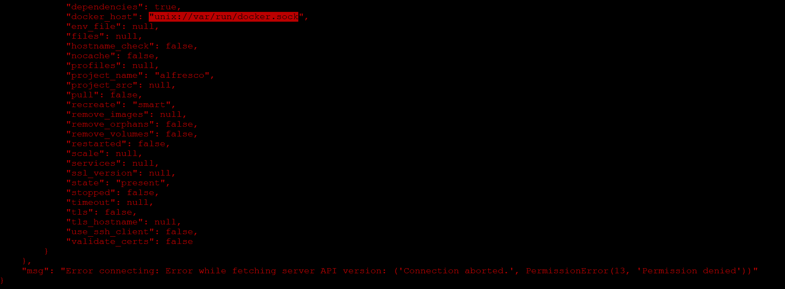
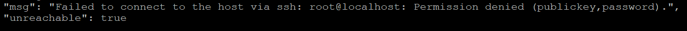

see templates/alfresco-remote

There would be one source machine with Xopera and Ansible, to operate several other target machines.
First, configure the machines to be able to SSH passwordlessly.
# Set SSH as Passwordless at target machines
1. generate public key in the source machine: id_ras.pub
2. copy source machine's public key to the target machine
```sh
ssh-copy-id username@remote-server
```


If the passwordless SSH doesn't work, check the following configutation in /etc/ssh/sshd_config

```
PubkeyAuthentication yes
AuthorizedKeysFile .ssh/authorized_keys
PasswordAuthentication no

```
After the modification, restart SSH service:
```sh
sudo service ssh restart
```

# Test if passwordless SSH is correctly configured

## directly test it
```sh
ping {{ target_machine_ip}}
```

## test with ansible
```sh
ansible -i {{ inventory file}}  -m ping {{ target_group }} 

```
in the inventory file, inventory.ini, defines the target_group like this:
```
[target_group]
target_machine ansible_host=192.168.221.133 ansible_user=ubuntu
```

# prepare the python environment
Because Ansible uses python, to run docker container in remote machines, docker and docker-compose python library should be installed there.
```
pip install docker
pip install docker-compose
```
This can be done manually before deploying Tosca templates, or put into the ansible tasks of the implementation.

# debug method
If things go wrong but Xopera gives no error messages, try using only Ansible, with more detailed outputs:
```
ansible-playbook -i {{ inventory_file }} -vvv {{ playbook_operation.yml }}
```

# Errors you might ran into


According to this answer, I set the permisson: 
```sh
sudo chmod666 /var/run/docker.sock # all users will have read and write permissions
```
From <https://stackoverflow.com/questions/64952238/docker-errors-dockerexception-error-while-fetching-server-api-version> 


# Finally deploy things with Xopera
Run the opera cmd of ```opera deploy service.yaml``` to deploy the template.

However, since I couldn't specifying the inventory file with the flag "-i", which is defined by Ansible, Ansible cannot recognize the {{ target_machine }} that it should operate on.
```yaml
  hosts: 
    - 127.0.0.1
    - target_machine # defined in inventory.ini
```

Adding the host in one individual task works for me:
```yaml
---
- name: add hosts to Ansible 
  hosts: localhost
  gather_facts: false  

  tasks:
    - name: Add host 
      add_host:
        name: target_machine
        ansible_host: 192.168.221.133
        ansible_user: ubuntu
- name: docker playbook
  hosts: 
    # - 127.0.0.1
    - target_machine 
  gather_facts: false

  tasks:
        
    - name: docker compose
    ... ...
```
use ``` sudo docker ps```, then you can see the newly-created container in the target machine.

# fix the hardcoding part
At first I hardcoded which host each node should be deployed on, in each of their Ansible playbook. And I only defined one "workstation" node, which all alfresco nodes deployed on.
As my supervisor pointed out, since I'm deploying across two machine, it's better to have two "workstation" nodes. And seperate the frontend nodes and backend nodes on them.
Thus, I let the alfresco-nodes "get_attributes" of "public_address" from the workstation they are dependent on, as the parameter of "ANSIBLE_HOST".
Then for each of the alfresco-nodes, pass the ANSIBLE_HOST into ansible playbook, and dynamically define the "hosts", using "add_host" module, and execute tasks on the machine ANSIBLE_HOST refers to.
But if I direcly use module "add_user" to add localhost into an host group. 

Ansible trys to SSH the localhost, which would be unreachable.

```yaml
---
- name: add hosts to Ansible 
  hosts: localhost 
  vars:
      host_ip: "{{ ANSIBLE_HOST }}"
  tasks:
    - name: Add host 
      add_host:
        name: target_machine
        ansible_host: "{{ ANSIBLE_HOST }}"
        ansible_user: "{{ ANSIBLE_USER }}"
      when: 
        - host_ip != "localhost" #only define the group of "target_machine" when the node is deployed on an external IP. 
- name: docker playbook
  hosts: 
    - target_machine:localhost # if target_machine is defined, then hosts=target_machine. if undefine, by default it's localhost.
  # gather_facts: false

  tasks:
  ... ...
```

An external ip needs to be added with add_host module, cannot direcly pass the input in as ```host: {{ ip_address}}```. As it needs to be connected with SSH, it needs to be added properly.
If uses ```host: {{ ip_address}}```, then it will SSH the root of this ip_address, which is usually not permitted for security reason. (I can change the configutaion to allow ssh of root, but it dosen't seem like a good idea.)
While localhost cannot be added with add_host module, it will throw error of  "msg: "Failed to connect to the host via ssh: root@localhost: Permission denied (publickey,password)."
I tried to set the fact ```ansible_connection: "local"```, however this would leads to docker SDK error, (which suggest me to use pip install docker),even though it's irrelavant with docker.
It's difficult to coordinate things since this two kind of machine has to be added in different ways.

hosts patterns I've tried:
```yaml
    - "{{ target_machine if host_ip!='localhost' else 'localhost' }}"
    - target_machine | default('localhost')
    - "{{ target_machine | default('localhost') }}"
    - target_machine
    - target_machine:&all
    - all[-1] 
    - target_machine 
```
all wrong.
Either it cannot recognize target_machine or it deploy on both target_machine and localhost

# execute sudo command in romote machine with Ansible
to connect to a remote machine, first I use add_host to add the host dynimically into Ansible's inventory list:
```yaml
  tasks:

    - name: Add targets 
      add_host:
        name: "{{ ANSIBLE_HOST_NAME }}" # the name I gave to this machine, for later reference
        ansible_host: "{{ ANSIBLE_HOST_IP }}" # ip address
        ansible_user: "{{ ANSIBLE_USER }}" # the user name I want to log in use SSH
      when: 
        - host_ip != "localhost"
```
Then in the next play book, I can change the host to the machine that I just defined: ```"{{ ANSIBLE_HOST_NAME }}"```. Ansible to SSH connect to this machine using the username I gave. 
To execute sudo task in this machine, need privilege escalation: https://docs.ansible.com/ansible/latest/playbook_guide/playbooks_privilege_escalation.html
1) use password to gain the prvilege
at first I defined the password in ansible with plain text, which is obviously NOT a SAFE option!
like this:
```yaml
- name: Join target machines to Docker Swarm
  hosts: 
    - "{{ ANSIBLE_HOST_NAME }}"
  gather_facts: false
  become: true #  use “become” to gain sudo privileges on the target machine
  become_method: sudo
  vars:
    ansible_become_pass: "xxx"


  tasks:

    - name: change permission
      command: sudo chmod 666 /var/run/docker.sock
```

2) configure this user on the target machine does not require a password to use sudo.
```sh
$ sudo visudo #edit the sudoers file
{{USERNAME}} ALL=(ALL:ALL) NOPASSWD: ALL  # add this line to it, with your username, it means this user can use all priveleges without password
```
However, even after I added this line, it still get prompted for a password when using sudo.
According to this answer, this is because the added line is overriden by other following lines after it:
https://superuser.com/questions/1495807/can-someone-explain-what-is-user-all-all-nopasswdall-does-in-sudoers-file

So I move the added line to the end of the file, then it works.
