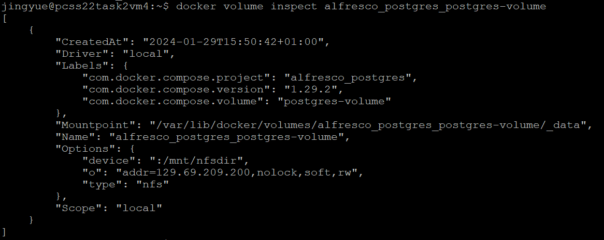

# some useful command for quick reference

## log into psql (alfresco)
```psql -U alfresco```
## check all existing tables
```select * from pg_tables;```
## check one table's information
```\d {{table_name}}```

# postgres nfs volume info
