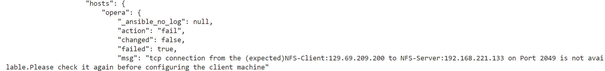
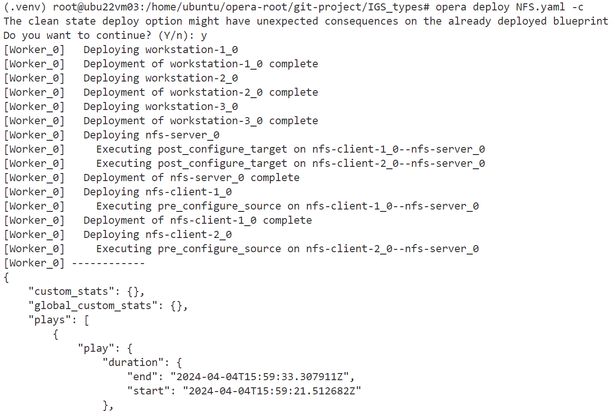

"msg": "tcp connection from the (expected)NFS-Client:129.69.209.200 to NFS-Server:192.168.221.133 on Port 2049 is not available.Please check it again before configuring the client machine"

[Worker_0]   Deploying workstation-1_0
[Worker_0]   Deployment of workstation-1_0 complete
[Worker_0]   Deploying workstation-2_0
[Worker_0]   Deployment of workstation-2_0 complete
[Worker_0]   Deploying workstation-3_0
[Worker_0]   Deployment of workstation-3_0 complete
[Worker_0]   Deploying nfs-server_0
[Worker_0]     Executing post_configure_target on nfs-client-1_0--nfs-server_0
[Worker_0]     Executing post_configure_target on nfs-client-2_0--nfs-server_0
[Worker_0]   Deployment of nfs-server_0 complete
[Worker_0]   Deploying nfs-client-1_0
[Worker_0]     Executing pre_configure_source on nfs-client-1_0--nfs-server_0
[Worker_0]   Deployment of nfs-client-1_0 complete
[Worker_0]   Deploying nfs-client-2_0
[Worker_0]     Executing pre_configure_source on nfs-client-2_0--nfs-server_0
[Worker_0] ------------
{
    "custom_stats": {},
    "global_custom_stats": {},
    "plays": [
        ... error message...